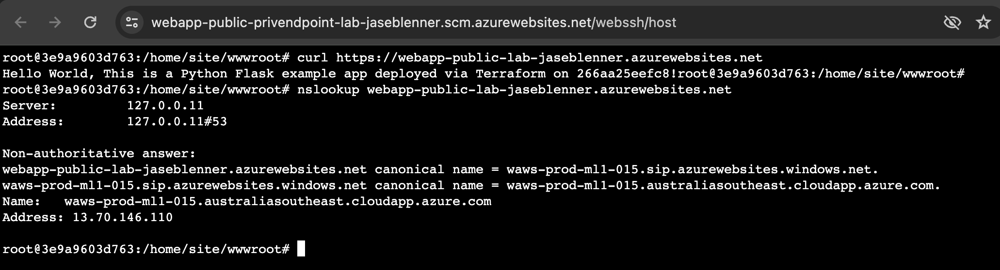

# lab-app-svc-privendpoint

This demo is intended to prove that it is possible to route traffic between two publicly accessible APIs [in this case, Linux Web App Services], privately

To achieve this, we must ensure both App Services are integrated either in the same VNet, or in VNets which are routable to one another VNet(s).

In short, we are proving that API to API traffic routes privately, whilst public access to the APIs still remain available

To achieve this, we configure a Private Endpoint in front of one of the API (#2), prove that both API #1 and #2 remain publicly accessible, and that API #1 connects to API #2 over the private network

# Proof

1. API #1 `webapp-public-lab-jaseblenner.azurewebsites.net` is accessible from a public location: 
2. API #2 `webapp-public-privendpoint-lab-jaseblenner.azurewebsites.net` is accessible from a public location: 
3. API #2 is configured with a private endpoint, API #1 is not, and both are linked to the same vnet (NB: being in the same VNet is not a requirement, they only need to be linked to VNets which are routable to one another).     
4. API #1 can access API #2 - API #2 is responding on a private IP when resolved from API #1 
5. API #2 can access API #1 - API #1 is responding on a public IP when resolved from API #2  